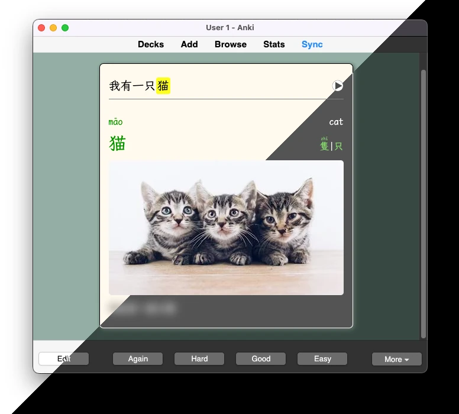

# anki-chinese-flashcard-template

Features:

- light and dark mode
- highlight target word in example sentence
- blurred text reveals mouse hover (works on mobile)

It's compatible with the [Chinese Support V4](https://ankiweb.net/shared/info/1240761427) (CSV4) add-on.

If you interested you can download the .apkg and import it to Anki. It contains a single example card that has all the styling.

- The javascript used to highlight the target word in a sentence came from [Raymon K on StackOverflow](https://stackoverflow.com/questions/74073774/anki-highlight-bold-target-word-in-example-sentences).
- Blurred fields: Pinyin, English, Extra.
- The font is [LXGW WenKai Mono](https://github.com/lxgw/LxgwWenKai) with Arial as fallback.

> This deck is configured to how **I** like my flashcards, obviously modify it to suit **your** needs as **you** see fit.

#### Cards

There are three cards for this note type.

1. Sentence - front has example sentence
2. Audio - front plays audio
3. Image - front has image

All are basic front-back cards. The front depends on card type, while the backs all have the same information.

#### Fields

- Hanzi - target word (will trigger CSV4 auto-fill)
- English - target word definition (CSV4)
- Recording - audio (change to "Sound" to work with CSV4)
- Sentence - example sentence
- Image - image
- Extra - additional notes, etc.
- Classifier - measure word (CSV4)
- Color - target word with tone color (CSV4)
- Pinyin - pinyin with tone color (CSV4)
- Ruby - target word and pinyin together with tone color (CSV4)
- Frequency - how common/rare target word is (CSV4)
